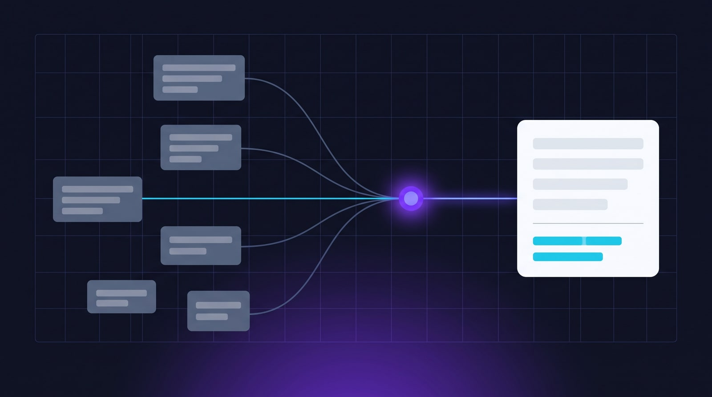
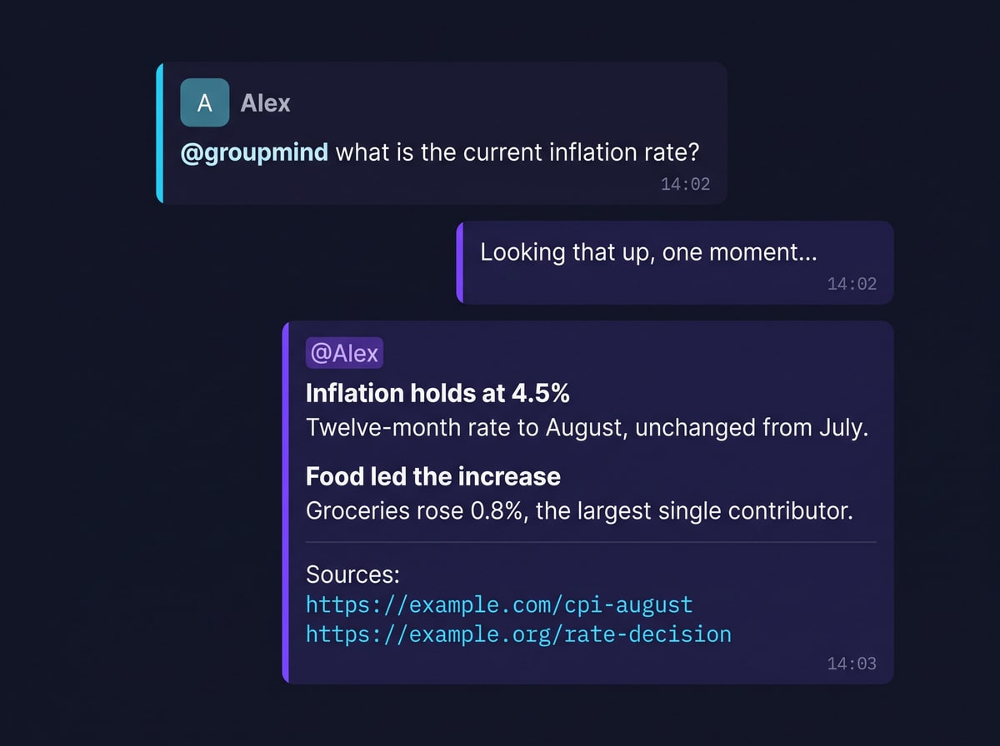
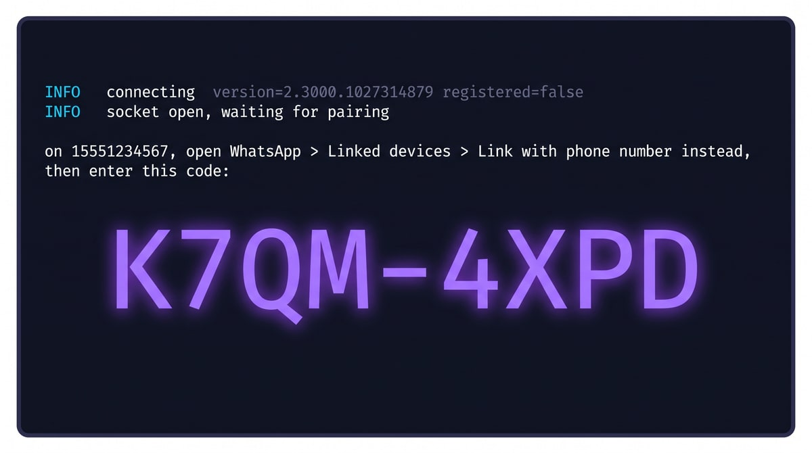
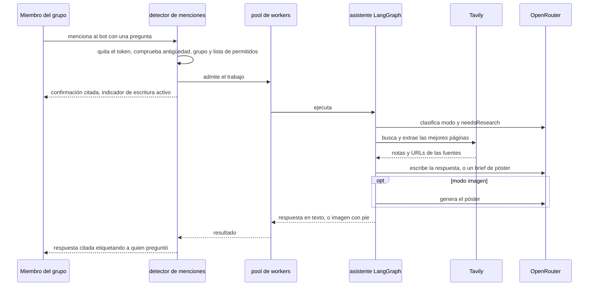
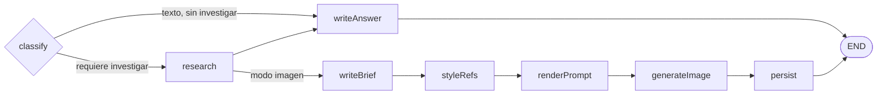
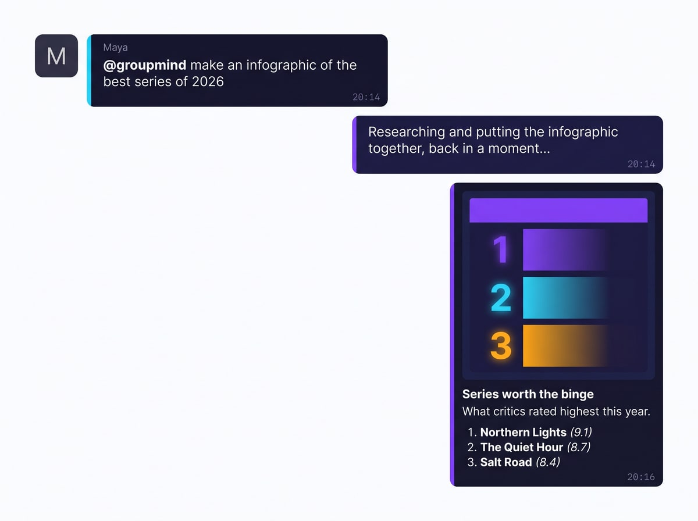
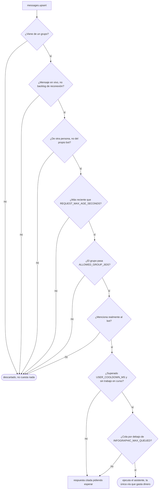
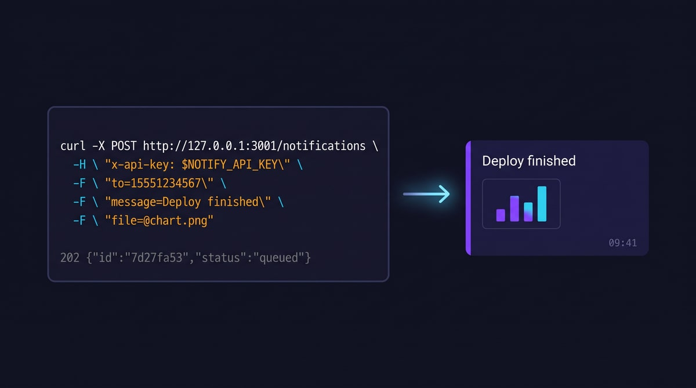

<div align="center">


# wa-groupmind

**Un bot para chats grupales que convierte `@bot <pregunta>` en una respuesta investigada y con fuentes — en texto por defecto, o como una infografía generada por IA cuando la pides.**

[](https://github.com/ndanilo/wa-groupmind/actions/workflows/ci.yml)
[](LICENSE)
[](https://nodejs.org)
[](tsconfig.json)
[](CONTRIBUTING.md)

**Léelo en otros idiomas:** [English](README.md) | [Português (Brasil)](README.pt-BR.md) | **Español**



</div>

---

> [!CAUTION]
> **No oficial, sin vínculo alguno, y puede hacer que baneen tu cuenta.**
>
> Este proyecto no está afiliado, respaldado ni conectado con WhatsApp LLC ni con Meta Platforms,
> Inc. Se comunica con WhatsApp a través de
> [Baileys](https://github.com/WhiskeySockets/Baileys), un cliente de ingeniería inversa. El uso
> automatizado puede infringir los
> [Términos de Servicio de WhatsApp](https://www.whatsapp.com/legal/terms-of-service), y Meta
> banea cuentas por ello sin previo aviso.
>
> **Vincula un número de prueba que puedas permitirte perder — nunca uno personal o crítico para
> tu negocio.** Para cualquier uso comercial, utiliza la
> [Plataforma de WhatsApp Business](https://business.whatsapp.com/products/business-platform) oficial.
>
> Lee [DISCLAIMER.md](DISCLAIMER.md) y [PRIVACY.md](PRIVACY.md) antes de desplegarlo.

> [!WARNING]
> **Cada ejecución cuesta dinero real** en OpenRouter (chat + imagen) y en Tavily (búsqueda).
> Mantén baja la concurrencia y configura `ALLOWED_GROUP_JIDS` para que nadie ajeno gaste tu
> crédito.
>
> La carpeta en `AUTH_DIR` contiene credenciales que otorgan acceso total a la cuenta vinculada.
> Trátala como una contraseña y mantenla fuera de git.

## Qué hace

Alguien menciona al bot en un grupo. Este investiga la pregunta en la web en vivo y responde en
el mismo hilo — una lista de temas escaneable por defecto, prosa cuando se pide una explicación,
o una infografía generada cuando la pregunta pide una imagen. Toda respuesta factual termina con
las URLs en las que se basó.

```
@groupmind ¿cuál es la tasa de inflación actual?    -> lista de temas en negrita, con fuentes
@groupmind explica la subida del dólar              -> explicación en prosa
@groupmind haz una infografía de la tasa de interés -> póster generado
```



## Stack

| Aspecto | Elección |
| --- | --- |
| Runtime | Node.js 22+ (desarrollado en 24), ESM |
| Lenguaje | TypeScript, strict, resolución `nodenext` |
| WhatsApp | `baileys` 7.x |
| Orquestación | `StateGraph` de `@langchain/langgraph` con enrutamiento condicional |
| Chat de IA | OpenRouter vía `@langchain/openai` + agente con tool calling |
| Búsqueda web | Tavily (`@langchain/tavily`) |
| Imágenes | OpenRouter `POST /images` |
| Registros | `pino`, formateado en desarrollo |

## Primeros pasos

Necesitas Node 22 o superior, una clave de [OpenRouter](https://openrouter.ai/keys), una clave de
[Tavily](https://app.tavily.com) y un número de WhatsApp que estés dispuesto a arriesgar.

```bash
git clone https://github.com/ndanilo/wa-groupmind.git
cd wa-groupmind
npm install
cp .env.example .env
# completa OPENROUTER_API_KEY, TAVILY_API_KEY y PHONE_NUMBER
npm run dev
```

### Vincular la cuenta

Hay dos formas, seleccionadas con `PAIRING_MODE`.

**Código de vinculación (`PAIRING_MODE=code`, el predeterminado)** — define `PHONE_NUMBER` con
el número que vas a vincular, solo dígitos con código de país y sin `+`. La terminal imprime un
código de 8 caracteres; introdúcelo en
**Ajustes → Dispositivos vinculados → Vincular con número de teléfono**. `PHONE_NUMBER` es
obligatorio en este modo y la app se niega a arrancar sin él.

**Código QR (`PAIRING_MODE=qr`)** — imprime un QR en la terminal para escanear desde
**Ajustes → Dispositivos vinculados → Vincular un dispositivo**. No necesita `PHONE_NUMBER`,
pero los códigos QR en la terminal a menudo no se pueden escanear según tu fuente y esquema de
colores, y por eso no son el predeterminado.



Las credenciales quedan en `.auth/` una vez vinculado, así que las ejecuciones posteriores
reconectan sin volver a emparejar.

### Elegir el idioma

El bot responde en el idioma que indique `OUTPUT_LANGUAGE` (BCP-47, por defecto `en`). Una
etiqueta que lleva región también le dice a Tavily qué fuentes de país priorizar — `pt-BR`
prioriza Brasil, `es-MX` prioriza México. Un `en` a secas no aplica ningún refuerzo regional.

Los mensajes operativos del propio bot (confirmaciones, errores, la ayuda de uso) están en inglés
y viven en un solo lugar: `MESSAGES` en [src/whatsapp/reply.ts](src/whatsapp/reply.ts).

## Cómo fluye una petición

Solo los mensajes **de grupo** que **mencionan al bot** disparan una ejecución. Los chats directos
se ignoran.

1. El bot verifica la mención, elimina el token `@…` y toma el resto como la pregunta.
2. Si la pregunta está vacía, responde con una breve ayuda de uso.
3. Al aceptar, envía una confirmación inmediata citando el mensaje e inicia el indicador de
   escritura.
4. El grafo enruta la pregunta, investigando y generando solo lo necesario.
5. La respuesta vuelve **citada**: texto etiquetando a quien preguntó, o una imagen cuyo pie es
   `*título*` + subtítulo (más la lista numerada en los rankings).
6. Ante cualquier fallo, no se envía nada salvo un error amable, citado y etiquetando a quien
   preguntó. Los stack traces se quedan en el registro.



Todo lo anterior a "admite el trabajo" es gratuito. Cada flecha hacia Tavily u OpenRouter cuesta
dinero, y por eso importan las barreras de admisión de más abajo.

### El grafo

El texto es lo predeterminado. Una imagen cuesta un ciclo de investigación, un brief y una
generación de imagen, así que esa rama solo se ejecuta cuando la pregunta realmente pide una
imagen.



`classify` decide dos cosas: **modo** (`text` o `image`) y **needsResearch**.

- Una pasada gratuita por palabras clave ([src/ai/graph/intent.ts](src/ai/graph/intent.ts))
  detecta las peticiones obvias — `infographic`, `image`, `poster`, `draw`, `chart`, y sus
  equivalentes en portugués. Una petición de imagen siempre implica investigación, así que se
  resuelve al instante sin pagar una llamada al modelo.
- Cualquier cosa ambigua pasa a un clasificador con temperatura 0 y salida estructurada. Si falla,
  el respaldo es texto investigado: una respuesta investigada nunca está mal, una imagen no
  deseada cuesta dinero.
- `needsResearch` es `false` solo para charla trivial o tareas de lenguaje autocontenidas (traduce
  esto, qué significa esta palabra). En ese caso la etapa de respuesta se ejecuta bajo un prompt
  que prohíbe afirmar cualquier cosa sensible al tiempo, ya que no tiene acceso a la web por esa
  vía.

`styleRefs` y `persist` son nodos normales que internamente no hacen nada según
`USE_IMAGE_REFERENCES` y `SAVE_GENERATED_IMAGES`, lo que mantiene honesta la forma del grafo en
Studio.

### Formato de la respuesta

Las respuestas en texto vienen en dos formas, y la **predeterminada es una lista de temas
escaneable** — de tres a seis titulares en negrita con una línea de dato concreto cada uno. Eso es
lo que la gente realmente lee en un grupo.

La prosa es **opcional**: `detectAnswerDepth` en
[src/ai/graph/intent.ts](src/ai/graph/intent.ts) busca una petición explícita (`explain`,
`detailed`, `analysis`, junto con `detalha`, `explica`, `aprofunda`, `por que`…) y solo entonces
cambia a párrafos, con un presupuesto de caracteres mayor.

Ambos presupuestos (`ANSWER_LIMITS` en
[src/ai/services/LLMService.ts](src/ai/services/LLMService.ts)) cubren **solo el cuerpo**. El
bloque final de fuentes — hasta cinco URLs simples — se separa, queda fuera del presupuesto y se
vuelve a adjuntar después, de modo que recortar una respuesta larga elimina el tema más débil en
lugar de las fuentes.

Toda respuesta en texto pasa luego por `toWhatsAppText`
([src/ai/lib/whatsappText.ts](src/ai/lib/whatsappText.ts)), que reescribe el markdown que el
modelo haya filtrado a la única sintaxis que WhatsApp renderiza: `**x**` y `## x` se vuelven
`*x*`, las viñetas se vuelven `•`, `[texto](url)` se vuelve `texto: url`, y los bloques de código
y tablas se aplanan. Los prompts prohíben markdown, pero un prompt no es una garantía.

La profundidad deliberadamente **no** se delega al clasificador. Cuando se le pidió juzgarla, el
modelo calificó un corriente "qué noticias hay hoy" como *detallado* y produjo exactamente el muro
de prosa que este formato existe para evitar. Un regex es determinista, está probado, y está
sesgado hacia el lado correcto — el coste de perder un vago "profundiza" es que el lector
reformule con "explica".

Cuando la pregunta pide una imagen, la respuesta es un póster cuyo pie lleva el título, el
subtítulo y — en los rankings — la lista numerada, de modo que el hilo sigue siendo útil aunque la
imagen resulte difícil de leer en una pantalla pequeña.

<table>
<tr>
<td width="58%"></td>
<td width="42%"></td>
</tr>
</table>

### Inspeccionar una ejecución

```bash
npm run langchain:server
```

Abre LangGraph Studio contra el mismo grafo compilado
([langgraph.json](langgraph.json) → [src/ai/graph/studio.ts](src/ai/graph/studio.ts)). Invócalo
solo con una pregunta:

```json
{ "question": "¿cuáles son las mejores series de 2026?" }
```

Studio muestra la decisión de enrutamiento, la actualización de estado de cada nodo y cada llamada
a herramienta, lo que supera con creces leer la salida de pino cuando una ejecución se tuerce.

### Concurrencia

Varias personas pueden preguntar a la vez. Las peticiones comparten un pool acotado de workers en
el proceso:

| Regla | Predeterminado |
| --- | --- |
| Ejecuciones simultáneas del grafo | `INFOGRAPHIC_CONCURRENCY=3` |
| Plazas extra de espera | `INFOGRAPHIC_MAX_QUEUED=10` |
| Máximo 1 en curso por usuario | — |
| Enfriamiento por usuario tras terminar | `USER_COOLDOWN_MS=5000` |
| Timeout duro del trabajo | `JOB_TIMEOUT_MS=300000` |

Cuando la cola está llena o el usuario ya está ejecutando o en enfriamiento, el bot responde con un
mensaje específico en lugar de iniciar otra ejecución de pago.

### Barreras de seguridad

Cada mensaje atraviesa este embudo antes de que ocurra nada facturable. Solo la última rama
gasta dinero.



- Solo grupos; los estados y canales se omiten.
- Solo mensajes en vivo (`notify`); los backlogs de reconexión (`append`) se ignoran.
- Los mensajes más antiguos que `REQUEST_MAX_AGE_SECONDS` se ignoran.
- Los mensajes propios nunca se responden, lo que evita un bucle de auto-respuesta.
- Lista de permitidos opcional `ALLOWED_GROUP_JIDS`.
- El contenido de los mensajes se mantiene fuera de los registros salvo que establezcas
  `LOG_MESSAGE_CONTENT=true`.

## Webhook de notificaciones

Un endpoint HTTP opcional que permite a un sistema externo enviar un mensaje de WhatsApp — con un
archivo adjunto — a través de esta app. Sin IA, y completamente separado del bot anterior: aquel
es entrante y reactivo, este es solo saliente.

**Desactivado por defecto.** Define `NOTIFY_ENABLED=true` y `NOTIFY_API_KEY` para activarlo.

```bash
curl -X POST http://127.0.0.1:3001/notifications \
  -H "x-api-key: $NOTIFY_API_KEY" \
  -F "to=525512345678" \
  -F "message=Despliegue finalizado" \
  -F "file=@grafico.png;type=image/png"
```

```json
{ "id": "7d27fa53-f6fb-4d87-bb97-70a028bc0593", "status": "queued" }
```



`202` significa encolado, no entregado — un envío tarda segundos y puede caer en mitad de una
reconexión, así que quien llama queda liberado de inmediato y `GET /notifications/:id` informa de
cómo fue realmente. Las notificaciones corren en su propio pool de workers, así que no pueden
asfixiar el pipeline de `@mención`.

La capa HTTP está deliberadamente aislada de WhatsApp para poder mudarse a su propio repositorio
más adelante. **[Documentación completa, decisiones de diseño y la guía de separación →](src/notifications/README.md)**

## Scripts

| Script | Descripción |
| --- | --- |
| `npm run dev` | Ejecuta desde TypeScript; recarga solo cuando cambia `./src` |
| `npm run dev:stable` | Igual, **sin** observar archivos (más seguro en sesiones largas) |
| `npm run typecheck` | Comprobación de tipos sin emitir |
| `npm run build` | Compila a `dist/` |
| `npm start` | Ejecuta la compilación (requiere `npm run build` antes) |
| `npm test` | Pruebas unitarias (`node:test`) |
| `npm run langchain:server` | LangGraph Studio contra el grafo del asistente |
| `npm run notify:server` | Solo el webhook de notificaciones, entregas registradas y no enviadas |

## Configuración

Se lee de `.env`; consulta [.env.example](.env.example) para la lista completa comentada.

| Variable | Predeterminado | Descripción |
| --- | --- | --- |
| `PAIRING_MODE` | `code` | `code` o `qr` |
| `PHONE_NUMBER` | — | Dígitos con código de país. **Obligatorio**, salvo con `PAIRING_MODE=qr` |
| `AUTH_DIR` | `.auth` | Carpeta de credenciales de sesión |
| `LOG_LEVEL` | `info` | Nivel de pino |
| `LOG_MESSAGE_CONTENT` | `false` | Registra el cuerpo de los mensajes. Desactivado por defecto, por privacidad |
| `ALLOWED_GROUP_JIDS` | _(todos)_ | JIDs de grupo separados por comas |
| `REQUEST_MAX_AGE_SECONDS` | `60` | Ignora mensajes más antiguos |
| `MAX_QUESTION_LENGTH` | `500` | Límite tras eliminar las menciones |
| `INFOGRAPHIC_CONCURRENCY` | `3` | Ejecuciones paralelas del grafo |
| `INFOGRAPHIC_MAX_QUEUED` | `10` | Tamaño de la lista de espera |
| `USER_COOLDOWN_MS` | `5000` | Intervalo tras un trabajo *exitoso* del mismo usuario (`0` lo desactiva) |
| `JOB_TIMEOUT_MS` | `300000` | Techo duro por trabajo |
| `BOT_DISPLAY_NAME` | `groupmind` | Nombre mostrado en las ayudas de uso (`@nombre …`) |
| `SEND_ACK` | `true` | Confirmación inmediata (el texto se adapta a texto vs imagen) |
| `TYPING_INDICATOR` | `true` | Presencia de "escribiendo" mientras trabaja |
| `SAVE_GENERATED_IMAGES` | `true` | Escribe los pósteres en `IMAGE_OUTPUT_DIR` |
| `USE_IMAGE_REFERENCES` | `true` | Temas editoriales: busca fotos reales como referencia de estilo |
| `IMAGE_REFERENCE_COUNT` | `2` | Cuántas URLs de foto pasar al modelo de imagen |
| `OPENROUTER_API_KEY` | — | **Obligatoria** para la generación |
| `TAVILY_API_KEY` | — | **Obligatoria** para la búsqueda web |
| `CHAT_MODEL` | `deepseek/deepseek-v4-flash-0731` | Slug de chat de OpenRouter |
| `IMAGE_MODEL` | `bytedance-seed/seedream-4.5` | Slug de imagen de OpenRouter |
| `IMAGE_ASPECT_RATIO` | `9:16` | Vertical por defecto |
| `IMAGE_RESOLUTION` | `2K` | Por debajo de 2K las etiquetas quedan ilegibles |
| `IMAGE_OUTPUT_FORMAT` | `jpeg` | Cargas más pequeñas en WhatsApp |
| `OUTPUT_LANGUAGE` | `en` | Idioma de toda respuesta, y la región que Tavily prioriza |

WhatsApp puede vincularse sin las claves de IA. La primera petición `@bot` sin ellas falla con una
respuesta de error de investigación y una línea clara en el registro.

Webhook de notificaciones (todo opcional, todo inerte mientras `NOTIFY_ENABLED=false`):

| Variable | Predeterminado | Descripción |
| --- | --- | --- |
| `NOTIFY_ENABLED` | `false` | Interruptor principal. Apagado significa que Fastify ni siquiera se carga |
| `NOTIFY_HOST` | `127.0.0.1` | Loopback por defecto; ampliar solo detrás de un proxy con TLS |
| `NOTIFY_PORT` | `3001` | |
| `NOTIFY_API_KEY` | — | **Obligatoria** cuando está activo; la app se niega a arrancar sin ella |
| `NOTIFY_MAX_FILE_BYTES` | `10485760` | Por archivo (10 MB) |
| `NOTIFY_MAX_FILES` | `4` | Adjuntos por petición |
| `NOTIFY_MAX_MESSAGE_LENGTH` | `4096` | |
| `NOTIFY_CONCURRENCY` | `2` | Su propio pool de workers, separado del bot |
| `NOTIFY_MAX_QUEUED` | `50` | Tamaño de la cola antes de `503` |
| `NOTIFY_ALLOWED_RECIPIENTS` | _(cualquiera)_ | Números o JIDs separados por comas |
| `NOTIFY_DEFAULT_COUNTRY_CODE` | — | Se antepone a números locales, p. ej. `1`, `52`, `34` |
| `NOTIFY_JOB_TTL_MS` | `3600000` | Cuánto tiempo un trabajo terminado sigue consultable |
| `NOTIFY_READY_TIMEOUT_MS` | `30000` | Cuánto espera un envío por un socket reconectando |
| `NOTIFY_JOB_TIMEOUT_MS` | `120000` | Techo del trabajo completo |

## Estructura del proyecto

```
src/
  index.ts                      entrada, runtime compartido, apagado ordenado
  server.ts                     solo el webhook de notificaciones (sin WhatsApp)
  config/env.ts                 el único lugar que lee process.env
  lib/
    logger.ts                   logger pino compartido
    queue.ts                    pool acotado de workers + admisión por usuario
  whatsapp/
    connection.ts               ciclo de vida del socket: vinculación, reconexión, cierre
    handlers/messages.ts        messages.upsert: registra y luego enruta menciones
    mention.ts                  detección de @bot (PN + LID) y análisis de la pregunta
    reply.ts                    envío de confirmación / texto / imagen / error
    infographic.ts              orquesta cola + grafo + respuestas
    socketGate.ts               publica el socket actualmente activo
    notify.ts                   entrega saliente para el webhook
  notifications/                webhook HTTP — ver su propio README
    contract.ts                 tipos compartidos; no importa nada
    wiring.ts                   raíz de composición
    gateway/                    borde Fastify; nunca importa whatsapp/ ni ai/
    worker/                     cola + almacén de trabajos; nunca importa HTTP
  ai/                           asistente LangGraph autocontenido
    config.ts                   ajustes de IA derivados del entorno
    graph/
      graph.ts                  cableado del StateGraph, enrutamiento, runAssistant()
      state.ts                  AssistantState (StateSchema)
      intent.ts                 pasada gratuita por palabras clave de intención de imagen
      studio.ts                 punto de entrada de LangGraph Studio
      nodes/                    un archivo por nodo, servicios inyectados
    services/                   LLMService, ImageService
    infographic/                esquema Zod del brief + constructor del prompt de imagen
    tools/                      datetime + búsqueda/extracción de Tavily
    lib/imageStore.ts           persistencia opcional en disco
```

## Cómo se comporta la conexión

- **Ejecuta una sola instancia.** WhatsApp permite una única conexión por dispositivo vinculado,
  así que una segunda instancia expulsa a la primera con `conflict / replaced`. Cuando eso ocurre,
  la perdedora termina de inmediato en lugar de reconectar.
- **Las credenciales se guardan en cada `creds.update`**, de lo contrario el siguiente arranque
  vuelve a pedir vinculación.
- **Las caídas transitorias reconectan** con backoff exponencial, limitado por
  `MAX_RECONNECT_ATTEMPTS`.
- **Las credenciales muertas** limpian la carpeta de autenticación y terminan — solo volver a
  vincular lo arregla.
- **Ctrl+C vacía la cola** y luego sale de verdad. Baileys deja temporizadores atrás, así que el
  apagado fuerza la salida del proceso; de otro modo una instancia persistente pelea con la
  siguiente ejecución por la sesión.

Si ves un bucle repetido de `conflict / replaced`, una instancia anterior sigue viva. En Windows:

```powershell
Get-CimInstance Win32_Process -Filter "Name='node.exe'" |
  Where-Object { $_.CommandLine -like '*src/index.ts*' } |
  ForEach-Object { Stop-Process -Id $_.ProcessId -Force }
```

## Contribuir

Los pull requests son bienvenidos — lee primero [CONTRIBUTING.md](CONTRIBUTING.md). La versión
corta: ejecuta `npm run typecheck`, `npm test` y `npm run build` antes de abrir uno, nunca subas
números, JIDs ni claves reales, y refleja cualquier cambio de documentación de cara al usuario en
los tres READMEs.

La participación se rige por el [Código de Conducta](CODE_OF_CONDUCT.md).

## Legal

| Documento | Qué cubre |
| --- | --- |
| [LICENSE](LICENSE) | MIT |
| [DISCLAIMER.md](DISCLAIMER.md) | Ausencia de vínculo con WhatsApp o Meta, aviso de marcas, Términos de Servicio y riesgo de baneo, usos prohibidos, responsabilidad del operador |
| [PRIVACY.md](PRIVACY.md) | Qué se procesa, qué se envía a OpenRouter y Tavily, qué se escribe en disco, y tus obligaciones como responsable del tratamiento bajo el RGPD y la LGPD |
| [SECURITY.md](SECURITY.md) | Cómo reportar una vulnerabilidad en privado, más notas de seguridad para el operador |
| [NOTICE](NOTICE) | Atribuciones de terceros y reconocimiento de marcas |

**wa-groupmind no está afiliado, respaldado ni conectado con WhatsApp LLC ni con Meta Platforms,
Inc.** WhatsApp y Meta son marcas registradas de Meta Platforms, Inc., usadas aquí únicamente para
describir la interoperabilidad. Los mantenedores no aprueban el uso de este software de ninguna
forma que infrinja los Términos de Servicio de WhatsApp, y no aceptan responsabilidad por el uso
que le des.

## Agradecimientos

Construido sobre [Baileys](https://github.com/WhiskeySockets/Baileys) de Rajeh Taher y la
comunidad WhiskeySockets, [LangChain.js y LangGraph.js](https://github.com/langchain-ai/langchainjs),
[Fastify](https://fastify.dev), [pino](https://getpino.io) y [sharp](https://sharp.pixelplumbing.com).
