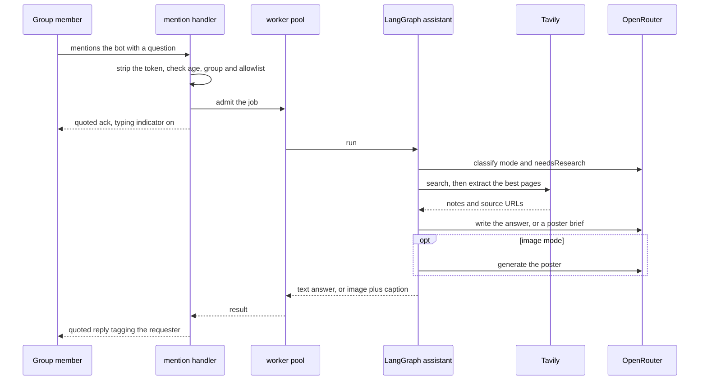
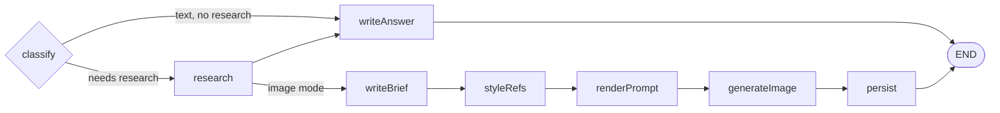
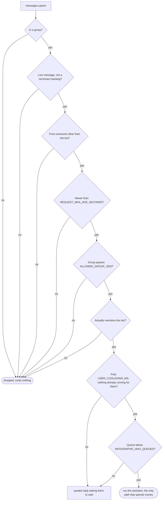

<div align="center">


# wa-groupmind

**A group chat bot that turns `@bot <question>` into a researched, sourced answer — as text by default, or as an AI-generated infographic poster when you ask for one.**

[](https://github.com/ndanilo/wa-groupmind/actions/workflows/ci.yml)
[](LICENSE)
[](https://nodejs.org)
[](tsconfig.json)
[](CONTRIBUTING.md)

**Read this in other languages:** **English** | [Português (Brasil)](README.pt-BR.md) | [Español](README.es.md)


</div>

---

> [!CAUTION]
> **Unofficial, unaffiliated, and it can get your account banned.**
>
> This project is not affiliated with, endorsed by, or connected to WhatsApp LLC or Meta
> Platforms, Inc. It reaches WhatsApp through [Baileys](https://github.com/WhiskeySockets/Baileys),
> a reverse-engineered client. Automated use may breach the
> [WhatsApp Terms of Service](https://www.whatsapp.com/legal/terms-of-service), and Meta bans
> accounts for it without warning.
>
> **Pair a test number you can afford to lose — never a personal or business-critical one.**
> For anything commercial, use the official
> [WhatsApp Business Platform](https://business.whatsapp.com/products/business-platform).
>
> Read [DISCLAIMER.md](DISCLAIMER.md) and [PRIVACY.md](PRIVACY.md) before you deploy.

> [!WARNING]
> **Every run costs real money** at OpenRouter (chat + image) and Tavily (search). Keep
> concurrency low and set `ALLOWED_GROUP_JIDS` so strangers cannot spend your credit.
>
> The folder in `AUTH_DIR` holds credentials granting full access to the linked account.
> Treat it like a password and keep it out of git.

## What it does

Someone mentions the bot in a group. It researches the question on the live web and replies in
the same thread — a scannable topic list by default, prose when asked to explain, or a
generated infographic when the question asks for a picture. Every factual answer ends with the
URLs it relied on.

```
@groupmind what is the current inflation rate?     -> bold topic list, with sources
@groupmind explain why the dollar is rising        -> prose explanation
@groupmind make an infographic about interest rates -> generated poster
```


## Stack

| Concern | Choice |
| --- | --- |
| Runtime | Node.js 22+ (developed on 24), ESM |
| Language | TypeScript, strict, `nodenext` resolution |
| WhatsApp | `baileys` 7.x |
| Orchestration | `@langchain/langgraph` `StateGraph` with conditional routing |
| AI chat | OpenRouter via `@langchain/openai` + tool-calling agent |
| Web search | Tavily (`@langchain/tavily`) |
| Images | OpenRouter `POST /images` |
| Logging | `pino`, pretty-printed in development |

## Getting started

You need Node 22 or newer, an [OpenRouter](https://openrouter.ai/keys) key, a
[Tavily](https://app.tavily.com) key, and a WhatsApp number you are willing to risk.

```bash
git clone https://github.com/ndanilo/wa-groupmind.git
cd wa-groupmind
npm install
cp .env.example .env
# fill OPENROUTER_API_KEY, TAVILY_API_KEY and PHONE_NUMBER
npm run dev
```

### Linking the account

Two ways, selected with `PAIRING_MODE`.

**Pairing code (`PAIRING_MODE=code`, the default)** — set `PHONE_NUMBER` to the number you are
linking, digits with country code and no `+`. The terminal prints an 8-character code; enter it
under **Settings → Linked devices → Link with phone number instead**. `PHONE_NUMBER` is required
in this mode and the app refuses to start without it.

**QR code (`PAIRING_MODE=qr`)** — prints a QR in the terminal to scan from
**Settings → Linked devices → Link a device**. No `PHONE_NUMBER` needed, but terminal QR codes
are frequently unscannable depending on your font and colour scheme, which is why they are not
the default.


Credentials land in `.auth/` once linked, so later runs reconnect without pairing again.

### Choosing a language

The bot answers in whatever `OUTPUT_LANGUAGE` says (BCP-47, default `en`). A tag carrying a
region also tells Tavily which country's sources to rank first — `pt-BR` boosts Brazil, `es-MX`
boosts Mexico. A plain `en` applies no regional boost.

The bot's own operational messages (acknowledgements, errors, the usage hint) are English and
live in one place: `MESSAGES` in [src/whatsapp/reply.ts](src/whatsapp/reply.ts).

## How a request flows

Only **group** messages that **@mention the bot** trigger a run. Direct chats are ignored.

1. The bot checks the mention, strips the `@…` token, and takes the rest as the question.
2. If the question is empty it replies with a short usage hint.
3. On accept it sends an immediate quoted acknowledgement and starts a typing indicator.
4. The graph routes the question, researching and generating only what is needed.
5. The reply comes back **quoted**: text tagging the requester, or an image whose caption is
   `*title*` + subtitle (plus the numbered list for rankings).
6. On any failure, nothing is sent except a friendly error, quoted and tagging the requester.
   Stack traces stay in the log.



Everything before "admit the job" is free. Every arrow to Tavily or OpenRouter costs money, which
is why the admission gates below matter.

### The graph

Text is the default. An image costs a research loop, a brief and an image generation, so that
branch only runs when the question actually asks for a picture.



`classify` decides four things: **mode** (`text` or `image`), **needsResearch**, **depth** and
**freshness**.

- A free keyword pass ([src/ai/graph/intent.ts](src/ai/graph/intent.ts)) catches the obvious
  asks — `infographic`, `image`, `poster`, `draw`, `chart`, and their Portuguese equivalents.
  An image request always implies research, so it short-circuits without paying for a model call.
- Anything ambiguous goes to a temperature-0 classifier with structured output. If it fails, the
  fallback is researched text: a researched answer is never wrong, an unwanted image costs money.
- `needsResearch` is `false` only for small talk or self-contained language tasks (translate
  this, what does this word mean). In that case the answer stage runs under a prompt that
  forbids stating anything time-sensitive, since it has no web access on that path.

`styleRefs` and `persist` are plain nodes that no-op internally on `USE_IMAGE_REFERENCES` and
`SAVE_GENERATED_IMAGES`, which keeps the graph shape honest in Studio.

### Retrieval is derived, not sampled

`detectFreshness` looks for a recency signal — `today`, `right now`, `latest`, `main headlines`,
`top stories`, `this week`, `recent`, an explicit `September 11`, plus the Spanish and
Portuguese equivalents — and returns `day`, `week` or `none`. That decides how Tavily retrieves
for the whole run:

- `day` / `week` → `topic=news` with `timeRange` to match. Results carry `published_date`, which
  is what lets the writer tell this morning's reporting from last night's.
- `none` → `topic=general`, with the `country` boost derived from `OUTPUT_LANGUAGE`.

**These used to be fields the research model filled in.** `TavilySearch`'s own schema asks for
`topic`, `timeRange`, `searchDepth` and the domain filters, so how well a question got
researched came down to which of them the model happened to set. The same question, minutes
apart, once ran an undated general search and read two news front pages, and once ran
`topic=news, timeRange=day` and read dated articles — the second answer was visibly better, and
nothing about the question decided which one you got.
[src/ai/tools/tavily.ts](src/ai/tools/tavily.ts) now wraps both tools in a query-only schema and
derives the rest.

Two consequences worth knowing:

- Tavily applies `country` **only** on the `general` topic, so the news path appends the country
  name to the query text instead. That is the only compensation the API offers. With the default
  `en` there is no region and so nothing to lose either way.
- On the recency path, `web_extract` **refuses a front page or section index** (a bare host,
  `/news`, `/latest-news`, `/ultimas-noticias`) and says why, because such a page carries
  headline teasers and no attributable article body. Off that path a site root is still fair
  game — "summarise this page for me" is a legitimate ask.

Today's date is stated in the research message rather than fetched: `get_current_datetime` was
step one of the prompt and the model followed it about half the time. The tool is still there
for arithmetic on dates.

### The research loop is bounded by time, not by call count

Research is the slowest node by a wide margin, and almost none of that is the search API. On a
question that asked for a ranked list with two figures per item, one run spent **675 seconds** in
the node: 667s of model generation against 8s of Tavily. It then returned nothing, because the job
ceiling had fired six minutes earlier. Four things are in place so that cannot repeat.

| Fix | Where |
| --- | --- |
| Cancellation. A timed-out job aborts its run instead of leaving the graph to spend money on an answer nobody will read | [src/lib/queue.ts](src/lib/queue.ts), threaded through `runAssistant` into every node's model call |
| Per-stage request budgets, so one stalled call cannot eat the job. Worst case is `timeoutMs × (maxRetries + 1)` per stage, and the node ceilings are sized to fit inside `JOB_TIMEOUT_MS` | `budgets` in [src/ai/config.ts](src/ai/config.ts), `NODE_TIMEOUT_MS` in [src/ai/graph/graph.ts](src/ai/graph/graph.ts) |
| A bounded thinking budget for the loop, exposed as `CHAT_RESEARCH_REASONING`. Reasoning is most of the generation time, and the loop was the one stage that still had it unbounded | `createResearchModel` in [src/ai/services/LLMService.ts](src/ai/services/LLMService.ts) |
| A wall-clock deadline that takes the tools away and makes the model write its notes, instead of letting the node timeout throw away every search the run paid for | [src/ai/lib/deadline.ts](src/ai/lib/deadline.ts) |

The tool budget (`maxToolCallsPerRun`, 10) is now a **cost** ceiling rather than a latency one. It
was 5, which is right for "what is the current inflation rate" and far too tight for a ranked list
of a dozen items — that question got as far as two of them. A run cut short by the deadline is
marked `truncated`, so the reply admits which part could not be confirmed.

Two payload fixes go with it. Tool results reaching the loop are stripped to the fields that are
actually read (`leanPayload` in [src/ai/tools/tavily.ts](src/ai/tools/tavily.ts)): on
`SEARCH_DEPTH=advanced` with three chunks per source, two parallel searches come back as tens of
kilobytes of JSON that every later turn re-reads, and none of it survives to the reader anyway
because `sources.ts` clips each source while collecting. Older tool results are then dropped from
the transcript entirely once it passes ~16k tokens (`contextEditingMiddleware`), since the loop has
already folded them into its own notes.

Each turn logs its own `elapsedMs`, token counts including hidden reasoning tokens, and which
OpenRouter provider served it, because reconstructing that split from wall-clock timestamps by hand
is not something anyone should have to do twice. A turn that outlasts one attempt's timeout is
logged as retried — LangChain does not report retries itself.

### Sources are bound to claims

The research loop's tool results used to reach the writing stages as one stringified Tavily
response per call, clipped to a character budget. A search response holding five results
survived as roughly the first result and a half, so titles, URLs and bodies arrived separated
from each other — and a writer shown floating sentences with no owner reassembles them by
plausibility. That is how an action ends up credited to whoever was named nearby rather than to
whoever took it.

[src/ai/lib/sources.ts](src/ai/lib/sources.ts) parses the payloads into records instead:

```
[S1] Supreme court opens inquiry into film funding
(example.com — published 2026-09-11)
The reporting justice authorised the inquiry on Thursday…
```

One block per source, deduplicated by URL, with an extracted body replacing the search snippet
for the same page and its title and date kept from whichever hit carried them. The answer prompt
then requires each fact line to end with its tag, and forbids writing a name and an action
together unless one source's text puts them together.

`bindSources` resolves those tags afterwards: the sources block is built from the tags the answer
actually used, in order of use, and the tags are stripped from what the reader sees. So the link
list describes what the answer rests on rather than everything the run searched — and a tag that
resolves to nothing is a claim with no source behind it, logged as `answer cited a source that
was never retrieved`. No extra model call is involved.

The header word above the links still comes from the model, in whatever `OUTPUT_LANGUAGE` says,
so a reply in a language nobody here hardcoded does not end in an English "Sources:". If the
writer ignores the tagging rule entirely, the top sources are used as a fallback: an imprecisely
sourced answer beats an unsourced one.

### Answer format

Text answers come in two shapes, and the **default is a scannable topic list** — three to six
bold headlines with one line of concrete fact each. That is what people actually read in a
group chat.

Prose is **opt-in**: `detectAnswerDepth` in [src/ai/graph/intent.ts](src/ai/graph/intent.ts)
looks for an explicit ask (`explain`, `detailed`, `analysis`, `why`, plus the Portuguese
`detalha`, `explica`, `aprofunda`, `por que`…) and only then switches to paragraphs, with a
larger character budget.

Both budgets (`ANSWER_LIMITS` in [src/ai/services/LLMService.ts](src/ai/services/LLMService.ts))
cover the **body only**. The trailing sources block — up to five bare URLs — is split off, kept
out of the budget and re-attached afterwards, so trimming a long answer drops the weakest topic
instead of the sources.

`DIGEST_BUDGETS` is the other half of that: the answer stage sees eight source blocks at 700
characters each, where it used to see four clipped tool blobs at 900. A reply budget that cannot
be filled with real material is an invitation to invent some.

Every text reply then goes through `toWhatsAppText`
([src/ai/lib/whatsappText.ts](src/ai/lib/whatsappText.ts)), which rewrites whatever markdown the
model leaked into the only syntax WhatsApp renders: `**x**` and `## x` become `*x*`, bullets
become `•`, `[text](url)` becomes `text: url`, fences and tables flatten. The prompts forbid
markdown, but a prompt is not a guarantee.

Depth is deliberately **not** delegated to the classifier. Asked to judge it, the model called an
ordinary "what's the news today" *detailed* and produced exactly the wall of prose this format
exists to avoid. A regex is deterministic, unit-tested, and biased the right way — the cost of
missing a vague "go deeper" is that the reader rephrases with "explain".

When the question asks for a picture, the reply is a poster whose caption carries the title,
subtitle and — for rankings — the numbered list, so the thread stays useful even if the image is
hard to read on a small screen.

<table>
<tr>
<td width="58%"></td>
<td width="42%"></td>
</tr>
</table>

### Inspecting a run

```bash
npm run langchain:server
```

Opens LangGraph Studio against the same compiled graph
([langgraph.json](langgraph.json) → [src/ai/graph/studio.ts](src/ai/graph/studio.ts)). Invoke it
with just a question:

```json
{ "question": "what are the best series of 2026?" }
```

Studio renders the routing decision, every node's state update and each tool call, which beats
reading the pino output when a run goes sideways.

### Concurrency

Several people can ask at once. Requests share a bounded in-process worker pool:

| Rule | Default |
| --- | --- |
| Concurrent graph runs | `INFOGRAPHIC_CONCURRENCY=3` |
| Extra waiting slots | `INFOGRAPHIC_MAX_QUEUED=10` |
| Max 1 in-flight per user | — |
| Per-user cooldown after a finish | `USER_COOLDOWN_MS=5000` |
| Job timeout backstop | `JOB_TIMEOUT_MS=900000` |

When the queue is full or a user is already running or in cooldown, the bot answers with a
specific message instead of starting another paid run.

`JOB_TIMEOUT_MS` is the net, not the control — the per-node ceilings in
[src/ai/graph/graph.ts](src/ai/graph/graph.ts) bound a run long before it. Reaching it **aborts**
the run: it used to only reject the caller, so a timed-out question got an apology and then went on
calling OpenRouter and Tavily for minutes, outside the concurrency limit, for an answer that was
discarded. If research passes 90s the group also gets one "still digging" notice, so a genuinely
hard question does not look like a dead bot.

### Safety gates

Every message runs this gauntlet before anything billable happens. Only the last branch spends
money.



- Groups only; status broadcasts and channels are skipped.
- Live messages only (`notify`); reconnect backlogs (`append`) are ignored.
- Messages older than `REQUEST_MAX_AGE_SECONDS` are ignored.
- Own messages are never answered, which avoids a self-reply loop.
- Optional `ALLOWED_GROUP_JIDS` allowlist.
- Message bodies stay out of the logs unless you set `LOG_MESSAGE_CONTENT=true`.

## Notification webhook

An optional HTTP endpoint that lets an external system send a WhatsApp message — with an
attached file — through this app. No AI involved, and completely separate from the bot above:
that one is inbound and reactive, this one is outbound only.

**Off by default.** Set `NOTIFY_ENABLED=true` and `NOTIFY_API_KEY` to turn it on.

```bash
curl -X POST http://127.0.0.1:3001/notifications \
  -H "x-api-key: $NOTIFY_API_KEY" \
  -F "to=15551234567" \
  -F "message=Deploy finished" \
  -F "file=@chart.png;type=image/png"
```

```json
{ "id": "7d27fa53-f6fb-4d87-bb97-70a028bc0593", "status": "queued" }
```


`202` means queued, not delivered — a send takes seconds and can land mid-reconnect, so the
caller is released immediately and `GET /notifications/:id` reports how it actually went.
Notifications run on their own worker pool, so they cannot starve the `@mention` pipeline.

The HTTP layer is deliberately isolated from WhatsApp so it can move to its own repository
later. **[Full documentation, design decisions and the repo-split guide →](src/notifications/README.md)**

## Scripts

| Script | Description |
| --- | --- |
| `npm run dev` | Run from TypeScript; reloads only when `./src` changes |
| `npm run dev:stable` | Same, **without** file watch (safer for long WhatsApp sessions) |
| `npm run typecheck` | Type check without emitting |
| `npm run build` | Compile to `dist/` |
| `npm start` | Run the compiled build (expects `npm run build` first) |
| `npm test` | Unit tests (`node:test`) |
| `npm run langchain:server` | LangGraph Studio against the assistant graph |
| `npm run notify:server` | Notification webhook alone, deliveries logged not sent |

## Configuration

Read from `.env`; see [.env.example](.env.example) for the full commented list.

| Variable | Default | Description |
| --- | --- | --- |
| `PAIRING_MODE` | `code` | `code` or `qr` |
| `PHONE_NUMBER` | — | Digits with country code. **Required** unless `PAIRING_MODE=qr` |
| `AUTH_DIR` | `.auth` | Session credentials folder |
| `LOG_LEVEL` | `info` | pino level |
| `LOG_MESSAGE_CONTENT` | `false` | Log message bodies. Off by default for privacy |
| `ALLOWED_GROUP_JIDS` | _(all)_ | Comma-separated group JIDs |
| `REQUEST_MAX_AGE_SECONDS` | `60` | Ignore older messages |
| `MAX_QUESTION_LENGTH` | `500` | Cap after stripping mentions |
| `INFOGRAPHIC_CONCURRENCY` | `3` | Parallel graph runs |
| `INFOGRAPHIC_MAX_QUEUED` | `10` | Waiting-list size |
| `USER_COOLDOWN_MS` | `5000` | Gap after a *successful* job from the same user (`0` disables) |
| `JOB_TIMEOUT_MS` | `900000` | Backstop per job; reaching it aborts the run |
| `BOT_DISPLAY_NAME` | `groupmind` | Handle shown in usage hints (`@name …`) |
| `SEND_ACK` | `true` | Immediate acknowledgement (wording adapts to text vs image) |
| `TYPING_INDICATOR` | `true` | Composing presence while working |
| `SAVE_GENERATED_IMAGES` | `true` | Write posters under `IMAGE_OUTPUT_DIR` |
| `USE_IMAGE_REFERENCES` | `true` | Editorial topics: fetch real news photos as style refs |
| `IMAGE_REFERENCE_COUNT` | `2` | How many photo URLs to pass to the image model |
| `OPENROUTER_API_KEY` | — | **Required** for generation |
| `TAVILY_API_KEY` | — | **Required** for web search |
| `SEARCH_DEPTH` | `advanced` | `basic` or `advanced`. The main Tavily cost driver — see below |
| `CHAT_MODEL` | `deepseek/deepseek-v4-flash-0731` | OpenRouter chat slug |
| `CHAT_REQUEST_TIMEOUT_MS` | `120000` | Ceiling for one completion attempt; cheaper stages cap lower |
| `CHAT_MAX_RETRIES` | `1` | Attempts after the first, per stage |
| `CHAT_RESEARCH_REASONING` | `low` | Thinking budget for the research loop: `off`, `low`, `medium`, `high` |
| `IMAGE_MODEL` | `bytedance-seed/seedream-4.5` | OpenRouter image slug |
| `IMAGE_ASPECT_RATIO` | `9:16` | Portrait by default |
| `IMAGE_RESOLUTION` | `2K` | Below 2K labels get unreadable |
| `IMAGE_OUTPUT_FORMAT` | `jpeg` | Smaller WhatsApp payloads |
| `OUTPUT_LANGUAGE` | `en` | Language of every reply, and the region Tavily boosts |

WhatsApp can still pair without the AI keys. The first `@bot` request without them fails with a
research error reply and a clear log line.

`SEARCH_DEPTH` is worth a second look if Tavily credits matter to you. Tavily bills by depth
rather than by result count, so `advanced` costs more per search than `basic` and it is the one
search setting that changes what a run costs. It is on by default because the snippets are what
an answer gets attributed from: on `basic` a result comes back as a couple of sentences, which is
enough to know a story exists and not enough to know who acted in it. Set it to `basic` to halve
that cost at the price of thinner evidence.

Notification webhook (all optional, all inert while `NOTIFY_ENABLED=false`):

| Variable | Default | Description |
| --- | --- | --- |
| `NOTIFY_ENABLED` | `false` | Master switch. Off means Fastify is never even loaded |
| `NOTIFY_HOST` | `127.0.0.1` | Loopback by default; widen only behind a TLS proxy |
| `NOTIFY_PORT` | `3001` | |
| `NOTIFY_API_KEY` | — | **Required** when enabled; the app refuses to boot without it |
| `NOTIFY_MAX_FILE_BYTES` | `10485760` | Per file (10 MB) |
| `NOTIFY_MAX_FILES` | `4` | Attachments per request |
| `NOTIFY_MAX_MESSAGE_LENGTH` | `4096` | |
| `NOTIFY_CONCURRENCY` | `2` | Its own worker pool, separate from the bot's |
| `NOTIFY_MAX_QUEUED` | `50` | Waiting-list size before `503` |
| `NOTIFY_ALLOWED_RECIPIENTS` | _(any)_ | Comma-separated numbers or JIDs |
| `NOTIFY_DEFAULT_COUNTRY_CODE` | — | Prepended to local numbers, e.g. `1`, `55`, `44` |
| `NOTIFY_JOB_TTL_MS` | `3600000` | How long a finished job stays queryable |
| `NOTIFY_READY_TIMEOUT_MS` | `30000` | How long a send waits for a reconnecting socket |
| `NOTIFY_JOB_TIMEOUT_MS` | `120000` | Whole-job ceiling |

## Project structure

```
src/
  index.ts                      entry, shared runtime, graceful shutdown
  server.ts                     notification webhook alone (no WhatsApp)
  config/env.ts                 the only place that reads process.env
  lib/
    logger.ts                   shared pino logger
    queue.ts                    bounded worker pool + per-user admission
  whatsapp/
    connection.ts               socket lifecycle: pairing, reconnect, teardown
    handlers/messages.ts        messages.upsert: log, then route mentions
    mention.ts                  @bot detection (PN + LID) and question parsing
    reply.ts                    ack / text / image / error senders
    infographic.ts              orchestrates queue + graph + replies
    socketGate.ts               publishes the currently live socket
    notify.ts                   outbound delivery for the webhook
  notifications/                HTTP webhook — see its own README
    contract.ts                 shared types; imports nothing
    wiring.ts                   composition root
    gateway/                    Fastify edge; never imports whatsapp/ or ai/
    worker/                     queue + job store; never imports HTTP
  ai/                           self-contained LangGraph assistant
    config.ts                   AI settings derived from env
    graph/
      graph.ts                  StateGraph wiring, routing, runAssistant()
      state.ts                  AssistantState (StateSchema)
      intent.ts                 free keyword passes: image intent, depth, freshness
      studio.ts                 LangGraph Studio entry point
      nodes/                    one file per node, services injected
    services/                   LLMService, ImageService
    infographic/                Zod brief schema + image prompt builder
    tools/                      datetime + Tavily, retrieval settings from freshness
    lib/sources.ts              source records, tagging, citation binding
    lib/deadline.ts             wall-clock bound on the research loop
    lib/turnLog.ts              per-turn latency, tokens and serving provider
    lib/imageStore.ts           optional disk persistence
```

## How the connection behaves

- **Run only one instance.** WhatsApp allows a single connection per linked device, so a second
  instance kicks the first off with `conflict / replaced`. When that happens the loser exits
  immediately rather than reconnecting.
- **Credentials are saved on every `creds.update`**, otherwise the next start asks to pair again.
- **Transient drops reconnect** with exponential backoff, capped at `MAX_RECONNECT_ATTEMPTS`.
- **A run survives a reconnect.** Baileys replaces the socket wholesale when it reconnects, so
  every reply asks for the live socket at the moment it sends rather than holding the one the
  question arrived on. An answer researched across a drop still reaches the group.
- **Dead credentials** clear the auth folder and exit — only pairing again can fix them.
- **Ctrl+C drains the queue** then exits for real. Baileys leaves timers behind, so shutdown
  forces the process to exit; otherwise a lingering instance fights the next run for the session.

If you see a repeating `conflict / replaced` loop, a previous instance is still alive. On Windows:

```powershell
Get-CimInstance Win32_Process -Filter "Name='node.exe'" |
  Where-Object { $_.CommandLine -like '*src/index.ts*' } |
  ForEach-Object { Stop-Process -Id $_.ProcessId -Force }
```

## Contributing

Pull requests are welcome — read [CONTRIBUTING.md](CONTRIBUTING.md) first. The short version:
run `npm run typecheck`, `npm test` and `npm run build` before you open one, never commit real
numbers, JIDs or keys, and mirror any user-facing documentation change into all three READMEs.

Participation is governed by the [Code of Conduct](CODE_OF_CONDUCT.md).

## Legal

| Document | What it covers |
| --- | --- |
| [LICENSE](LICENSE) | MIT |
| [DISCLAIMER.md](DISCLAIMER.md) | No affiliation with WhatsApp or Meta, trademark notice, Terms of Service and ban risk, prohibited uses, operator responsibility |
| [PRIVACY.md](PRIVACY.md) | What is processed, what is sent to OpenRouter and Tavily, what is written to disk, and your obligations as data controller under the GDPR and LGPD |
| [SECURITY.md](SECURITY.md) | How to report a vulnerability privately, plus operator security notes |
| [NOTICE](NOTICE) | Third-party attributions and trademark acknowledgements |

**wa-groupmind is not affiliated with, endorsed by, or connected to WhatsApp LLC or Meta
Platforms, Inc.** WhatsApp and Meta are trademarks of Meta Platforms, Inc., used here only to
describe interoperability. The maintainers do not condone using this software in any way that
violates WhatsApp's Terms of Service, and accept no liability for how you use it.

## Acknowledgements

Built on [Baileys](https://github.com/WhiskeySockets/Baileys) by Rajeh Taher and the
WhiskeySockets community, [LangChain.js and LangGraph.js](https://github.com/langchain-ai/langchainjs),
[Fastify](https://fastify.dev), [pino](https://getpino.io) and [sharp](https://sharp.pixelplumbing.com).
