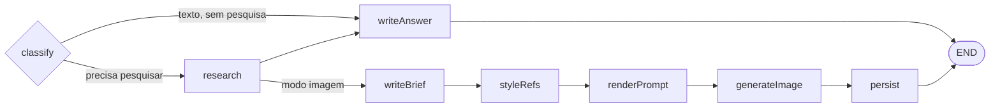

<div align="center">


# wa-groupmind

**Um bot para grupos que transforma `@bot <pergunta>` em uma resposta pesquisada e com fontes — em texto por padrão, ou como um infográfico gerado por IA quando você pede.**

[](https://github.com/ndanilo/wa-groupmind/actions/workflows/ci.yml)
[](LICENSE)
[](https://nodejs.org)
[](tsconfig.json)
[](CONTRIBUTING.md)

**Leia em outros idiomas:** [English](README.md) | **Português (Brasil)** | [Español](README.es.md)


</div>

---

> [!CAUTION]
> **Não oficial, sem qualquer vínculo, e pode banir sua conta.**
>
> Este projeto não é afiliado, endossado nem conectado ao WhatsApp LLC ou à Meta Platforms, Inc.
> Ele conversa com o WhatsApp através do [Baileys](https://github.com/WhiskeySockets/Baileys),
> um cliente de engenharia reversa. O uso automatizado pode violar os
> [Termos de Serviço do WhatsApp](https://www.whatsapp.com/legal/terms-of-service), e a Meta
> bane contas por isso sem aviso.
>
> **Vincule um número de teste que você pode perder — nunca um pessoal ou crítico para o
> negócio.** Para qualquer uso comercial, utilize a
> [Plataforma WhatsApp Business](https://business.whatsapp.com/products/business-platform) oficial.
>
> Leia [DISCLAIMER.md](DISCLAIMER.md) e [PRIVACY.md](PRIVACY.md) antes de colocar no ar.

> [!WARNING]
> **Cada execução custa dinheiro de verdade** no OpenRouter (chat + imagem) e no Tavily (busca).
> Mantenha a concorrência baixa e configure `ALLOWED_GROUP_JIDS` para que estranhos não gastem
> o seu crédito.
>
> A pasta em `AUTH_DIR` guarda credenciais que dão acesso total à conta vinculada. Trate como
> uma senha e mantenha fora do git.

## O que ele faz

Alguém marca o bot em um grupo. Ele pesquisa a pergunta na web ao vivo e responde na mesma
conversa — uma lista de tópicos escaneável por padrão, texto corrido quando pedem explicação, ou
um infográfico gerado quando a pergunta pede uma imagem. Toda resposta factual termina com as
URLs em que ela se baseou.

```
@groupmind qual a taxa de inflação atual?          -> lista de tópicos em negrito, com fontes
@groupmind explica a alta do dólar                 -> explicação em texto corrido
@groupmind faz um infográfico da taxa de juros     -> pôster gerado
```

## Stack

| Aspecto | Escolha |
| --- | --- |
| Runtime | Node.js 22+ (desenvolvido no 24), ESM |
| Linguagem | TypeScript, strict, resolução `nodenext` |
| WhatsApp | `baileys` 7.x |
| Orquestração | `StateGraph` do `@langchain/langgraph` com roteamento condicional |
| Chat de IA | OpenRouter via `@langchain/openai` + agente com tool calling |
| Busca web | Tavily (`@langchain/tavily`) |
| Imagens | OpenRouter `POST /images` |
| Logs | `pino`, formatado em desenvolvimento |

## Primeiros passos

Você precisa de Node 22 ou mais recente, uma chave do [OpenRouter](https://openrouter.ai/keys),
uma chave do [Tavily](https://app.tavily.com) e um número de WhatsApp que esteja disposto a
arriscar.

```bash
git clone https://github.com/ndanilo/wa-groupmind.git
cd wa-groupmind
npm install
cp .env.example .env
# preencha OPENROUTER_API_KEY, TAVILY_API_KEY e PHONE_NUMBER
npm run dev
```

### Vinculando a conta

São dois caminhos, escolhidos com `PAIRING_MODE`.

**Código de pareamento (`PAIRING_MODE=code`, o padrão)** — defina `PHONE_NUMBER` com o número
que está sendo vinculado, apenas dígitos com código do país e sem `+`. O terminal imprime um
código de 8 caracteres; digite-o em
**Configurações → Dispositivos conectados → Conectar com número de telefone**. `PHONE_NUMBER` é
obrigatório nesse modo e o app se recusa a iniciar sem ele.

**QR code (`PAIRING_MODE=qr`)** — imprime um QR no terminal para escanear em
**Configurações → Dispositivos conectados → Conectar um dispositivo**. Não precisa de
`PHONE_NUMBER`, mas QR codes no terminal frequentemente não são escaneáveis dependendo da sua
fonte e do esquema de cores, e é por isso que não são o padrão.

As credenciais ficam em `.auth/` depois do vínculo, então as execuções seguintes reconectam sem
parear de novo.

### Escolhendo o idioma

O bot responde no idioma definido em `OUTPUT_LANGUAGE` (BCP-47, padrão `en`). Uma tag que carrega
região também informa ao Tavily quais fontes priorizar — `pt-BR` prioriza o Brasil, `es-MX`
prioriza o México. Um `en` puro não aplica nenhum reforço regional.

As mensagens operacionais do próprio bot (confirmações, erros, dica de uso) estão em inglês e
ficam em um único lugar: `MESSAGES` em [src/whatsapp/reply.ts](src/whatsapp/reply.ts).

## Como uma requisição flui

Somente mensagens **de grupo** que **marcam o bot** disparam uma execução. Conversas diretas são
ignoradas.

1. O bot verifica a menção, remove o token `@…` e usa o resto como pergunta.
2. Se a pergunta estiver vazia, responde com uma dica de uso curta.
3. Ao aceitar, envia uma confirmação imediata citando a mensagem e inicia o indicador de digitação.
4. O grafo roteia a pergunta, pesquisando e gerando apenas o necessário.
5. A resposta volta **citada**: texto marcando quem perguntou, ou uma imagem cuja legenda é
   `*título*` + subtítulo (mais a lista numerada em rankings).
6. Em qualquer falha, nada é enviado além de um erro amigável, citado e marcando quem perguntou.
   Stack traces ficam no log.

### O grafo

Texto é o padrão. Uma imagem custa um ciclo de pesquisa, um briefing e uma geração de imagem, por
isso esse ramo só roda quando a pergunta realmente pede uma figura.



`classify` decide duas coisas: **modo** (`text` ou `image`) e **needsResearch**.

- Uma passada gratuita por palavras-chave ([src/ai/graph/intent.ts](src/ai/graph/intent.ts))
  captura os pedidos óbvios — `infográfico`, `imagem`, `arte`, `pôster`, `desenha`, além dos
  equivalentes em inglês. Um pedido de imagem sempre implica pesquisa, então ele resolve na hora
  sem pagar por uma chamada de modelo.
- Qualquer coisa ambígua vai para um classificador com temperatura 0 e saída estruturada. Se
  falhar, o fallback é texto pesquisado: uma resposta pesquisada nunca está errada, uma imagem
  indesejada custa dinheiro.
- `needsResearch` é `false` apenas para conversa fiada ou tarefas de linguagem autocontidas
  (traduz isso, o que significa esta palavra). Nesse caso a etapa de resposta roda sob um prompt
  que proíbe afirmar qualquer coisa sensível ao tempo, já que não há acesso à web nesse caminho.

`styleRefs` e `persist` são nós comuns que internamente não fazem nada conforme
`USE_IMAGE_REFERENCES` e `SAVE_GENERATED_IMAGES`, o que mantém o formato do grafo honesto no Studio.

### Formato da resposta

Respostas em texto vêm em dois formatos, e o **padrão é uma lista de tópicos escaneável** — de
três a seis manchetes em negrito com uma linha de fato concreto cada. É isso que as pessoas
realmente leem em um grupo.

Texto corrido é **opt-in**: `detectAnswerDepth` em
[src/ai/graph/intent.ts](src/ai/graph/intent.ts) procura um pedido explícito (`detalha`,
`explica`, `aprofunda`, `por que`, além de `explain`, `detailed`, `analysis`…) e só então muda
para parágrafos, com um orçamento maior de caracteres.

Ambos os orçamentos (`ANSWER_LIMITS` em
[src/ai/services/LLMService.ts](src/ai/services/LLMService.ts)) cobrem **apenas o corpo**. O
bloco final de fontes — até cinco URLs puras — é separado, fica fora do orçamento e é reanexado
depois, de modo que cortar uma resposta longa derruba o tópico mais fraco em vez das fontes.

Toda resposta em texto passa então por `toWhatsAppText`
([src/ai/lib/whatsappText.ts](src/ai/lib/whatsappText.ts)), que reescreve qualquer markdown que o
modelo tenha vazado na única sintaxe que o WhatsApp renderiza: `**x**` e `## x` viram `*x*`,
bullets viram `•`, `[texto](url)` vira `texto: url`, blocos de código e tabelas são achatados. Os
prompts proíbem markdown, mas um prompt não é uma garantia.

A profundidade deliberadamente **não** é delegada ao classificador. Quando pedimos que ele
julgasse, o modelo classificou um "quais as notícias de hoje" comum como *detalhado* e produziu
exatamente o paredão de texto que esse formato existe para evitar. Um regex é determinístico,
testado, e enviesado para o lado certo — o custo de perder um "vai mais fundo" vago é o leitor
reformular com "explica".

### Inspecionando uma execução

```bash
npm run langchain:server
```

Abre o LangGraph Studio contra o mesmo grafo compilado
([langgraph.json](langgraph.json) → [src/ai/graph/studio.ts](src/ai/graph/studio.ts)). Invoque
apenas com uma pergunta:

```json
{ "question": "quais as melhores séries de 2026?" }
```

O Studio mostra a decisão de roteamento, a atualização de estado de cada nó e cada chamada de
ferramenta, o que é bem melhor do que ler a saída do pino quando uma execução dá errado.

### Concorrência

Várias pessoas podem perguntar ao mesmo tempo. As requisições compartilham um pool limitado de
workers no processo:

| Regra | Padrão |
| --- | --- |
| Execuções simultâneas do grafo | `INFOGRAPHIC_CONCURRENCY=3` |
| Vagas extras de espera | `INFOGRAPHIC_MAX_QUEUED=10` |
| Máximo de 1 em andamento por usuário | — |
| Intervalo por usuário após concluir | `USER_COOLDOWN_MS=5000` |
| Timeout rígido do job | `JOB_TIMEOUT_MS=300000` |

Quando a fila está cheia ou o usuário já está executando ou em intervalo, o bot responde com uma
mensagem específica em vez de iniciar outra execução paga.

### Travas de segurança

- Somente grupos; status e canais são ignorados.
- Somente mensagens ao vivo (`notify`); backlogs de reconexão (`append`) são ignorados.
- Mensagens mais antigas que `REQUEST_MAX_AGE_SECONDS` são ignoradas.
- Mensagens próprias nunca são respondidas, o que evita um laço de auto-resposta.
- Lista opcional de permissão `ALLOWED_GROUP_JIDS`.
- O conteúdo das mensagens fica fora dos logs, a menos que você defina `LOG_MESSAGE_CONTENT=true`.

## Webhook de notificação

Um endpoint HTTP opcional que permite a um sistema externo enviar uma mensagem de WhatsApp — com
arquivo anexado — através deste app. Sem IA, e completamente separado do bot acima: aquele é de
entrada e reativo, este é apenas de saída.

**Desligado por padrão.** Defina `NOTIFY_ENABLED=true` e `NOTIFY_API_KEY` para ligar.

```bash
curl -X POST http://127.0.0.1:3001/notifications \
  -H "x-api-key: $NOTIFY_API_KEY" \
  -F "to=5511987654321" \
  -F "message=Deploy finalizado" \
  -F "file=@grafico.png;type=image/png"
```

```json
{ "id": "7d27fa53-f6fb-4d87-bb97-70a028bc0593", "status": "queued" }
```

`202` significa enfileirado, não entregue — um envio leva segundos e pode cair no meio de uma
reconexão, então quem chamou é liberado imediatamente e `GET /notifications/:id` reporta como
realmente foi. As notificações rodam no próprio pool de workers, então não conseguem sufocar o
pipeline de `@menção`.

A camada HTTP é deliberadamente isolada do WhatsApp para poder migrar para o próprio repositório
mais tarde. **[Documentação completa, decisões de projeto e o guia de separação →](src/notifications/README.md)**

## Scripts

| Script | Descrição |
| --- | --- |
| `npm run dev` | Roda a partir do TypeScript; recarrega só quando `./src` muda |
| `npm run dev:stable` | Igual, **sem** observar arquivos (mais seguro para sessões longas) |
| `npm run typecheck` | Checagem de tipos sem emitir |
| `npm run build` | Compila para `dist/` |
| `npm start` | Roda o build compilado (exige `npm run build` antes) |
| `npm test` | Testes unitários (`node:test`) |
| `npm run langchain:server` | LangGraph Studio contra o grafo do assistente |
| `npm run notify:server` | Só o webhook de notificação, entregas logadas e não enviadas |

## Configuração

Lida a partir do `.env`; veja [.env.example](.env.example) para a lista completa comentada.

| Variável | Padrão | Descrição |
| --- | --- | --- |
| `PAIRING_MODE` | `code` | `code` ou `qr` |
| `PHONE_NUMBER` | — | Dígitos com código do país. **Obrigatório**, exceto com `PAIRING_MODE=qr` |
| `AUTH_DIR` | `.auth` | Pasta das credenciais de sessão |
| `LOG_LEVEL` | `info` | Nível do pino |
| `LOG_MESSAGE_CONTENT` | `false` | Loga o corpo das mensagens. Desligado por padrão, por privacidade |
| `ALLOWED_GROUP_JIDS` | _(todos)_ | JIDs de grupo separados por vírgula |
| `REQUEST_MAX_AGE_SECONDS` | `60` | Ignora mensagens mais antigas |
| `MAX_QUESTION_LENGTH` | `500` | Limite após remover as menções |
| `INFOGRAPHIC_CONCURRENCY` | `3` | Execuções paralelas do grafo |
| `INFOGRAPHIC_MAX_QUEUED` | `10` | Tamanho da fila de espera |
| `USER_COOLDOWN_MS` | `5000` | Intervalo após um job *bem-sucedido* do mesmo usuário (`0` desativa) |
| `JOB_TIMEOUT_MS` | `300000` | Teto rígido por job |
| `BOT_DISPLAY_NAME` | `groupmind` | Nome mostrado nas dicas de uso (`@nome …`) |
| `SEND_ACK` | `true` | Confirmação imediata (o texto se adapta a texto vs imagem) |
| `TYPING_INDICATOR` | `true` | Presença "digitando" enquanto trabalha |
| `SAVE_GENERATED_IMAGES` | `true` | Grava os pôsteres em `IMAGE_OUTPUT_DIR` |
| `USE_IMAGE_REFERENCES` | `true` | Temas editoriais: busca fotos reais como referência de estilo |
| `IMAGE_REFERENCE_COUNT` | `2` | Quantas URLs de foto passar ao modelo de imagem |
| `OPENROUTER_API_KEY` | — | **Obrigatória** para geração |
| `TAVILY_API_KEY` | — | **Obrigatória** para busca web |
| `CHAT_MODEL` | `deepseek/deepseek-v4-flash-0731` | Slug de chat do OpenRouter |
| `IMAGE_MODEL` | `bytedance-seed/seedream-4.5` | Slug de imagem do OpenRouter |
| `IMAGE_ASPECT_RATIO` | `9:16` | Retrato por padrão |
| `IMAGE_RESOLUTION` | `2K` | Abaixo de 2K os rótulos ficam ilegíveis |
| `IMAGE_OUTPUT_FORMAT` | `jpeg` | Payloads menores no WhatsApp |
| `OUTPUT_LANGUAGE` | `en` | Idioma de toda resposta, e a região que o Tavily prioriza |

O WhatsApp ainda consegue parear sem as chaves de IA. A primeira requisição `@bot` sem elas falha
com uma resposta de erro de pesquisa e uma linha clara no log.

Webhook de notificação (tudo opcional, tudo inerte enquanto `NOTIFY_ENABLED=false`):

| Variável | Padrão | Descrição |
| --- | --- | --- |
| `NOTIFY_ENABLED` | `false` | Chave geral. Desligado significa que o Fastify nem é carregado |
| `NOTIFY_HOST` | `127.0.0.1` | Loopback por padrão; só amplie atrás de um proxy com TLS |
| `NOTIFY_PORT` | `3001` | |
| `NOTIFY_API_KEY` | — | **Obrigatória** quando ligado; o app se recusa a subir sem ela |
| `NOTIFY_MAX_FILE_BYTES` | `10485760` | Por arquivo (10 MB) |
| `NOTIFY_MAX_FILES` | `4` | Anexos por requisição |
| `NOTIFY_MAX_MESSAGE_LENGTH` | `4096` | |
| `NOTIFY_CONCURRENCY` | `2` | Pool próprio de workers, separado do bot |
| `NOTIFY_MAX_QUEUED` | `50` | Tamanho da fila antes de `503` |
| `NOTIFY_ALLOWED_RECIPIENTS` | _(qualquer)_ | Números ou JIDs separados por vírgula |
| `NOTIFY_DEFAULT_COUNTRY_CODE` | — | Prefixado a números locais, ex.: `1`, `55`, `44` |
| `NOTIFY_JOB_TTL_MS` | `3600000` | Por quanto tempo um job concluído fica consultável |
| `NOTIFY_READY_TIMEOUT_MS` | `30000` | Quanto um envio espera por um socket reconectando |
| `NOTIFY_JOB_TIMEOUT_MS` | `120000` | Teto do job inteiro |

## Estrutura do projeto

```
src/
  index.ts                      entrada, runtime compartilhado, shutdown gracioso
  server.ts                     só o webhook de notificação (sem WhatsApp)
  config/env.ts                 o único lugar que lê process.env
  lib/
    logger.ts                   logger pino compartilhado
    queue.ts                    pool limitado de workers + admissão por usuário
  whatsapp/
    connection.ts               ciclo de vida do socket: pareamento, reconexão, encerramento
    handlers/messages.ts        messages.upsert: loga e então roteia menções
    mention.ts                  detecção de @bot (PN + LID) e parsing da pergunta
    reply.ts                    envio de confirmação / texto / imagem / erro
    infographic.ts              orquestra fila + grafo + respostas
    socketGate.ts               publica o socket atualmente ativo
    notify.ts                   entrega de saída para o webhook
  notifications/                webhook HTTP — veja o README próprio
    contract.ts                 tipos compartilhados; não importa nada
    wiring.ts                   raiz de composição
    gateway/                    borda Fastify; nunca importa whatsapp/ ou ai/
    worker/                     fila + armazenamento de jobs; nunca importa HTTP
  ai/                           assistente LangGraph autocontido
    config.ts                   configurações de IA derivadas do env
    graph/
      graph.ts                  montagem do StateGraph, roteamento, runAssistant()
      state.ts                  AssistantState (StateSchema)
      intent.ts                 passada gratuita por palavras-chave de intenção de imagem
      studio.ts                 ponto de entrada do LangGraph Studio
      nodes/                    um arquivo por nó, serviços injetados
    services/                   LLMService, ImageService
    infographic/                schema Zod do briefing + construtor do prompt de imagem
    tools/                      datetime + busca/extração do Tavily
    lib/imageStore.ts           persistência opcional em disco
```

## Como a conexão se comporta

- **Rode apenas uma instância.** O WhatsApp permite uma única conexão por dispositivo vinculado,
  então uma segunda instância derruba a primeira com `conflict / replaced`. Quando isso acontece,
  a perdedora encerra imediatamente em vez de reconectar.
- **As credenciais são salvas a cada `creds.update`**, senão a próxima inicialização pede
  pareamento de novo.
- **Quedas transitórias reconectam** com backoff exponencial, limitado por `MAX_RECONNECT_ATTEMPTS`.
- **Credenciais mortas** limpam a pasta de autenticação e encerram — só parear de novo resolve.
- **Ctrl+C esvazia a fila** e então encerra de verdade. O Baileys deixa timers para trás, então o
  shutdown força a saída do processo; caso contrário uma instância remanescente briga com a
  próxima execução pela sessão.

Se você vir um laço repetido de `conflict / replaced`, uma instância anterior ainda está viva. No
Windows:

```powershell
Get-CimInstance Win32_Process -Filter "Name='node.exe'" |
  Where-Object { $_.CommandLine -like '*src/index.ts*' } |
  ForEach-Object { Stop-Process -Id $_.ProcessId -Force }
```

## Contribuindo

Pull requests são bem-vindos — leia [CONTRIBUTING.md](CONTRIBUTING.md) primeiro. A versão curta:
rode `npm run typecheck`, `npm test` e `npm run build` antes de abrir um, nunca comite números,
JIDs ou chaves reais, e espelhe qualquer mudança de documentação voltada ao usuário nos três
READMEs.

A participação é regida pelo [Código de Conduta](CODE_OF_CONDUCT.md).

## Jurídico

| Documento | O que cobre |
| --- | --- |
| [LICENSE](LICENSE) | MIT |
| [DISCLAIMER.md](DISCLAIMER.md) | Ausência de vínculo com WhatsApp ou Meta, aviso de marcas, Termos de Serviço e risco de banimento, usos proibidos, responsabilidade do operador |
| [PRIVACY.md](PRIVACY.md) | O que é processado, o que é enviado ao OpenRouter e ao Tavily, o que é gravado em disco, e suas obrigações como controlador de dados sob a LGPD e o GDPR |
| [SECURITY.md](SECURITY.md) | Como reportar uma vulnerabilidade em privado, mais notas de segurança para o operador |
| [NOTICE](NOTICE) | Atribuições de terceiros e reconhecimento de marcas |

**wa-groupmind não é afiliado, endossado nem conectado ao WhatsApp LLC ou à Meta Platforms, Inc.**
WhatsApp e Meta são marcas registradas da Meta Platforms, Inc., usadas aqui apenas para descrever
a interoperabilidade. Os mantenedores não aprovam o uso deste software de qualquer forma que
viole os Termos de Serviço do WhatsApp, e não aceitam responsabilidade por como você o utiliza.

## Agradecimentos

Construído sobre o [Baileys](https://github.com/WhiskeySockets/Baileys) de Rajeh Taher e da
comunidade WhiskeySockets, [LangChain.js e LangGraph.js](https://github.com/langchain-ai/langchainjs),
[Fastify](https://fastify.dev), [pino](https://getpino.io) e [sharp](https://sharp.pixelplumbing.com).
